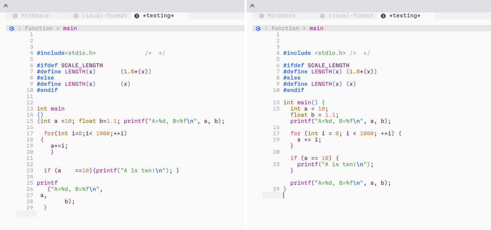

Virtual Format
==

This package provides a simple mode to visually format buffers without modifying
them.

### Motivation

When working on big and dirty projects, we usually face the problem of badly
formatted source files (mixed tabs and spaces, messy indentation, inconsistent
code formatting, etc.)

The trivial (and naive) way of dealing with this kind of problems is to format
the files and commit them to the central repository. However, in real world
projects, it is not that simple!

I found myself working on some complex projects and with dirty formatting! So,
Emacs being Emacs, I know that I can do something to format the buffer visually
without actually modifying it. I've looked-up but didn't find a package that
does this.

### Example

Having this dirty code at the left side, it becomes like the one on the right
side after calling `virtual-format-buffer`:

### Basic usage

TLDR; you can use this package in one of the three scenarios:

1. You can call `virtual-format-buffer`, `virtual-format-region` or
   `virtual-format-mode` to virtually format the current buffer/region. If the
   command succeeds, the buffer becomes formatted while you can modify the
   buffer without affecting the original formatting.
2. If the former commands failed to format the buffer, you can try the
   `virtual-format-buffer-incrementally`, this command will try to format code
   blocks from the top-level, and when a block fails, it tries to format each
   sub-block independently. Please note that this strategy is quite slow and can
   fail for some languages.
3. As a last resort, in order to **view** a buffer as formatted without
   modifying it. You can call the `virtual-format-view-mode`, this mode is very
   simple, it only calls the formatter and displays the formatted buffer as
   read-only. No fancy stuff are performed (actually, we don't even need Tree
   Sitter for this mode).

### How it works?

The idea behind this package is quite simple, for a target buffer, it creates a
temporary buffer with the same content and formats it with the formatter of your
choice (customize it via `virtual-format-buffer-formatter-function`). Then,
transposes the spaces and newlines from the formatted buffer to the original
buffers via Emacs' _text properties_.

In order to know where to look, `virtual-format` uses Tree Sitter (via Emacs 29+
`treesit`), it walks the AST for the original buffer and the formatted buffer to
the token level, and then, it copies the spaces/newlines between the tokens from
the formatted buffer to the original one. What we mean here by *copying* is the
fact that Emacs will **display** the spaces present in the original buffer
**as** the spaces observed in the formatted buffer, hence, you don't change the
buffer content and we still have editing access to the code in between. This
means that, when editing and saving virtually formatted buffer, we will not
change the formatting, only the manually edited part gets written to the file.

#### Assumptions

For `virtual-format-region` and `virtual-format-buffer`, the following
assumption has to be verified:

> [!CAUTION]
> The formatted buffer **should** have the same AST as the original buffer

In other words, if the used formatter adds some instructions the original code,
like replacing an `if-else` with a `switch-case` or something similar.

Sometimes, depending on the buffer being formatted or not, Tree Sitter might
produce a buggy AST (in such cases, you should report the issue in the
corresponding Tree Sitter grammar repository). This can make the virtual
formatting fail, in this case, you can set the
`virtual-format-keep-incomplete-formatting` to non-nil in order to keep the
formatted regions. If you want to see where the formatting has failed, you can
set `virtual-format-jump-on-incomplete-formatting` so the point (cursor) jumps
to the problematic position when the error occurs.

These issues can also happen when the used formatter modifies the code
significantly.

> [!IMPORTANT]
> In both cases, you can try to invoke `virtual-format-buffer-incrementally` so
> `virtual-format` does its best to format the buffer.
