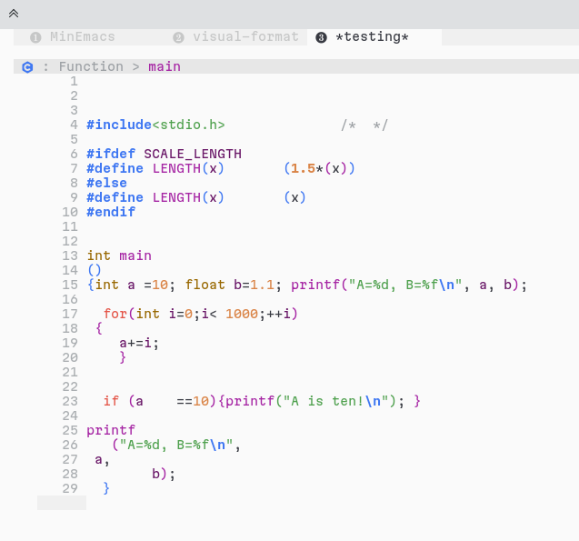
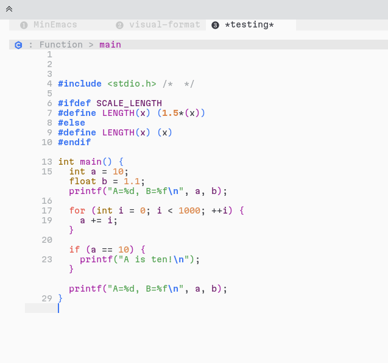

Virtual Format
==

This package provides a simple mode to visually format buffers without modifying
them.

### Motivation

Indeed, when working on big and dirty projects, we usually face the problem of
badly formatted source files (mixed tabs and spaces, messy indentation,
inconsistent code formatting, etc.)

The trivial (and naive) way of dealing with this kind of problems is to format
the files and commit them to the central repository. However, in real world
projects, it is not that simple!

I found myself working on some complex projects and with dirty formatting! So,
Emacs being Emacs, I know that I can do something to format the buffer visually
without actually modifying it. I've looked-up but didn't find a package that
does this.

### Example

Having this dirty code:

It becomes like this after calling `virtual-format-buffer`:

### How it works?

The idea behind this package is quite simple, for a messy buffer, it creates a
temporary buffer with the same content and formats it with the function of your
choice (customize it via `virtual-format-buffer-formatter-function`). Then,
transposes the spaces from the formatted buffer to the original buffers via
Emacs' _text properties_.

In order to know where to look, `virtual-format` uses Tree Sitter (via Emacs 29+
`treesit`), it walks the AST for the original buffer and the formatted buffer
set the spaces in the original buffer according to these observed in the
formatted buffer.

#### Assumptions

For `virtual-format-region` and `virtual-format-buffer`, the following
assumption has to be verified:

> [!CAUTION]
> The formatted buffer **should** have the same AST as the original buffer

In other words, if the used formatter adds some instructions the original code,
like replacing an `if-else` with a `switch-case` or something similar.

Sometimes, depending on the buffer being formatted or not, Tree Sitter might
produce a buggy AST (in such cases, you should report the issue in the
corresponding Tree Sitter grammar repository). This can make the virtual
formatting fail, in this case, you can set the
`virtual-format-keep-incomplete-formatting` to non-nil in order to keep the
formatted regions. If you want to see where the formatting has failed, you can
set `virtual-format-jump-on-incomplete-formatting` so the point (cursor) jumps
to the problematic position when the error occurs.

These issues can also happen when the used formatter modifies the code
significantly.

In both cases, you can try to invoke `virtual-format-buffer-incrementally` so
`virtual-format` does its best to format the buffer.
